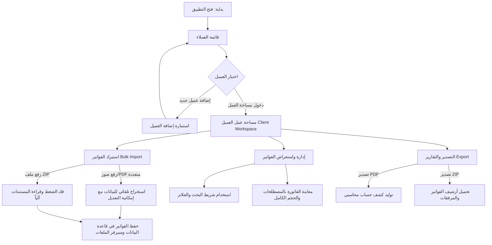

# 📄 دليل وهيكل مشروع نظام إدارة المكتب المحاسبي (Compta Dashboard)

---

## 📌 1. نظرة عامة على المشروع (Project Overview)
**نظام إدارة المكتب المحاسبي (Compta Dashboard)** هو تطبيق ويب متكامل ومصمم خصيصاً لمكاتب المحاسبة والخبراء المحاسبيين لإدارة عملاء المكتب وفواتيرهم (المشتريات والمبيعات) بسهولة وفاعلية عالية.

### الأهداف الرئيسية:
* **تسهيل أرشفة وإدارة الفواتير:** تنظيم كافة الفواتير (PDF وصور) لكل عميل بشكل منفصل.
* **الاستيراد المتعدد والجماعي:** دعم رفع عشرات الفواتير دفعة واحدة (ملفات منفردة أو ملفات مضغوطة ZIP) مع استخراج تلقائي لبياناتها من أسماء الملفات.
* **التصدير والتقارير:** إمكانية حزم الفواتير وتصديرها كملف ZIP أو كتقارير PDF محاسبية مجمعة.
* **البحث والفلترة المتقدمة:** شريط بحث فوري مع فلاتر حسب الشهور والفترات والأنواع.
* **تجربة مستخدم عربية احترافية:** دعم كامل للغة العربية والاتجاه من اليمين إلى اليسار (RTL) مع تصميم عصري وواجهة مظلمة/مضاءة (Dark / Light Mode).

---

## 🛠️ 2. البنية التقنية (Tech Stack & Architecture)

### 🔹 الواجهة الأمامية (Frontend):
* **React 19 & TypeScript:** لبناء واجهات مستخدم مخصصة وقوية مع نمط أنواع صارم.
* **Vite:** خادم تطوير فائق السرعة وأداة تجميع وتجميع للحزم (Bundler).
* **Tailwind CSS & Radix UI:** تصميم أنيق ومستجيب مع مكونات accessibility عالية الجودة.
* **TanStack Router:** إدارة التوجيه بين الصفحات بطريقة Type-safe.
* **TanStack Table:** عرض وإدارة الجداول الضخمة بكفاءة عالية.
* **Lucide React:** حزمة أيقونات عصرية ومتكاملة.
* **jsPDF & jsPDF-AutoTable:** توليد تقارير كشوفات الفواتير بصيغة PDF باللغة العربية.
* **JSZip:** فك ضغط الأرشيفات عند الاستيراد وإنشاء ملفات ZIP عند التصدير الجماعي.

### 🔹 الواجهة الخلفية (Backend & Storage):
* **Node.js & Express:** خادم خفيف لسحب وإدارة البيانات والملفات.
* **SQLite3:** قاعدة بيانات محليّة خفيفة وسريعة لتخزين بيانات العملاء والفواتير.
* **Multer:** إدارة ورفع المستندات والملفات وتخزينها في السيرفر المحلي.

---

## 📁 3. هيكلية المشروع (Directory Structure)

```text
compta/
├── public/                 # الملفات العامة والإستاتيكية
├── server/                 # خادم الخلفية (Backend)
│   ├── data/               # مجلد تخزين قاعدة البيانات SQLite
│   ├── storage/            # مجلد حفظ المستندات والملفات المرفوعة
│   ├── db.js               # إعداد وجداول قاعدة البيانات (Clients & Invoices)
│   └── index.js            # مسارات الـ API (REST API Endpoints)
├── src/                    # كود الواجهة الأمامية (Frontend)
│   ├── components/         # المكونات (UI Components)
│   │   ├── clients/        # استمارات ومكونات العملاء (إضافة/تعديل)
│   │   ├── clients-data/   # صفحة بيانات وقوائم العملاء
│   │   ├── dashboard/      # مساحات العمل والجداول وإدارة الفواتير
│   │   │   ├── client-workspace-page.tsx  # مساحة عمل العميل (المكون الرئيسي)
│   │   │   ├── clients-table.tsx          # جدول العملاء
│   │   │   ├── document-viewer-modal.tsx  # عارض المستندات والفواتير
│   │   │   └── stats-cards.tsx            # البطاقات الإحصائية
│   │   ├── layout/         # الهيكل العام (الشريط الجانبي، القائمة العلويّة، الثيم)
│   │   └── ui/             # مكونات التصميم الأساسية (Button, Input, Select, Dialog...)
│   ├── context/            # السياقات (Theme Context, Direction Context)
│   ├── hooks/              # الخطاطيف المخصصة (useClients, useInvoices, useTheme)
│   ├── lib/                # الأدوات المساعدة (pdf-generator, utils)
│   ├── routes/             # مسارات التنقل (TanStack Router)
│   ├── types/              # تعريفات الأنواع (Client & Invoice Types)
│   ├── index.css           # أنماط Tailwind ومتغيرات CSS
│   └── main.tsx            # نقطة انطلاق تطبيق React
├── package.json            # إعدادات الحزم والاعتماديات
├── tailwind.config.ts      # إعدادات الثيم والألوان والتصميم
└── vite.config.ts          # إعدادات البناء والتجميع Vite
```

---

## ⭐ 4. مميزات التطبيق الرئيسية (Key Features)

### 1️⃣ إدارة العملاء (Clients Management)
* إضافة عميل جديد بكافة بياناته الهامة (الاسم، السجل التجاري، الرقم الضريبي، الهاتف، العنوان).
* تعديل وحذف بيانات العملاء بسهولة.
* بطاقات إحصائية تُظهر إجمالي العملاء، الفواتير النشطة، وتفاصيل المبيعات والمشتريات.

### 2️⃣ مساحة عمل العميل الشاملة (Client Workspace)
* **تبويب الفواتير:** جدول تفاعلي يعرض كافة فواتير العميل.
* **إضافة فاتورة فردية:** رفع فاتورة واحدة وتعبئة بياناتها يدويًا أو تلقائيًا.
* **الاستيراد المتعدد والجماعي (Bulk Import):**
  * دعم اختيار مجموعة ملفات (PDF، PNG، JPG) دفعة واحدة.
  * دعم رفع ملف أرشيف مضغوط (`.zip`) يحتوي على عشرات الفواتير والمجلدات الفرعية.
  * **استخلاص تلقائي ذكي:** تحليل اسم الملف لاستخراج (نوع الفاتورة: مشتريات/مبيعات، رقم الفاتورة، التاريخ، المبلغ الصافي HT والمبلغ الإجمالي TTC).
* **عارض المستندات المدمج (Document Viewer):**
  * تكبير وتدوير ومعاينة الصور وملفات الـ PDF داخل التطبيق دون الحاجة لتنزيلها.
* **البحث والفلترة المتعددة:**
  * شريط بحث فوري يتيح البحث برقم الفاتورة، اسم المتعامل، الملاحظات، أو المبالغ.
  * فلترة حسب نوع الفاتورة (مشتريات / مبيعات).
  * فلترة حسب الشهر والفترة الزمانية.
* **التصدير المتقدم (Bulk Export):**
  * تصدير جميع أو الفواتير المحددة كملف أرشيف مضغوط ZIP يحتوي على المستندات الأصلية.
  * تصدير تقرير محاسبي مجمع بصيغة PDF منسق وجاهز للطباعة.

### 3️⃣ تصميم الواجهة وتجربة المستخدم (UI & UX)
* واجهة داعمة للغة العربية بالكامل وباتجاه يمين-إلى-يسار (RTL).
* التبديل السلس بين الوضع المظلم (Dark Mode) والوضع المضيء (Light Mode).
* تنبيهات تفاعلية بواسطة مكتبة `Sonner` عند نجاح أو فشل العمليات.

---

## 🔄 5. سيناريوهات العمل وتدفق البيانات (Workflow Scenarios)



---

## 🗄️ 6. نموذج البيانات (Data Schema)

### جدول العملاء (`clients`):
* `id` (INTEGER PRIMARY KEY)
* `name` (TEXT) - اسم العميل / الشركة
* `company_name` (TEXT) - اسم المؤسسة
* `tax_number` (TEXT) - الرقم الضريبي / NIF
* `commercial_register` (TEXT) - السجل التجاري / RC
* `phone` (TEXT) - رقم الهاتف
* `email` (TEXT) - البريد الإلكتروني
* `address` (TEXT) - العنوان
* `created_at` (DATETIME)

### جدول الفواتير (`invoices`):
* `id` (INTEGER PRIMARY KEY)
* `client_id` (INTEGER - Foreign Key)
* `invoice_number` (TEXT) - رقم الفاتورة
* `type` (TEXT) - `purchase` (مشتريات) أو `sale` (مبيعات)
* `date` (TEXT) - تاريخ الفاتورة
* `counterparty` (TEXT) - اسم المورد أو الزبون
* `amount_ht` (REAL) - المبلغ الصافي قبل الضريبة
* `amount_ttc` (REAL) - المبلغ الإجمالي شاملاً الضريبة
* `notes` (TEXT) - ملاحظات
* `file_path` (TEXT) - مسار المستند المخزن في الخادم
* `created_at` (DATETIME)

---

## 🚀 7. تشغيل المشروع (Running the Application)

1. **تثبيت الاعتماديات:**
   ```bash
   npm install
   ```

2. **تشغيل الخادم والواجهة معاً (Dev Mode):**
   ```bash
   npm run dev
   ```
   * خادم Express يعمل على المنفذ `3001`.
   * تطبيق Vite يعمل على المنفذ `5173`.

3. **فحص الأنواع وبناء نسخة الإنتاج (Production Build):**
   ```bash
   npm run build
   ```

---

## 🔮 8. التطلعات والمراحل القادمة (Phase 2 Roadmap)

* **التعرف الذكي على النصوص (OCR / AI Extraction):** دمج نموذج ذكاء اصطناعي لقراءة الفواتير الممسوحة ضوئياً واستخراج المبالغ والتأاريخ والشركات تلقائياً بدقة أعلى.
* **التقارير الإحصائية المتقدمة:** رسوم بيانية ومخططات توضح نمو الأرباح والمبيعات والمشتريات شهرياً وسنوياً.
* **إدارة المستخدمين والأذونات:** دعم متعدد المستخدمين (محاسب رئيسي، محاسب مساعد، عميل).
